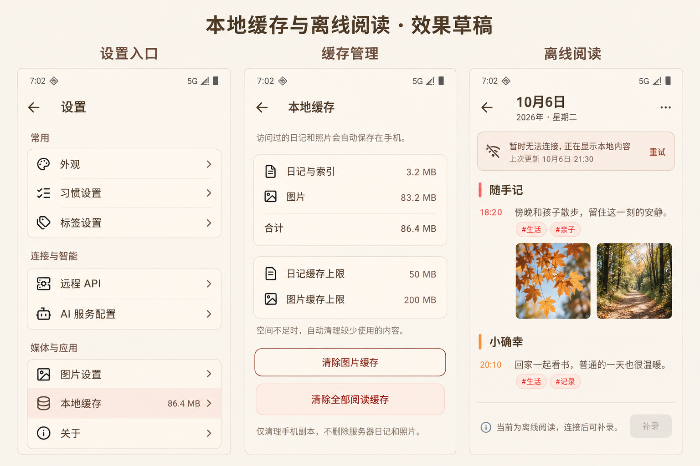

# 日记与图片缓存、离线阅读 v1

## 确认效果图

草稿使用 imagegen 结合现有界面生成，仅确认设置入口、清理操作和离线提示，容量为示例。正式页面继续使用 Flutter、Flora 组件和现有图墙，不进行全局视觉改造。

## 本轮实现

`ReadingCacheRepository` 管理应用私有系统缓存目录 `reading_cache_v1` 中的阅读副本，原始 API 数据仍由现有 Parser 解析。规范化服务器地址与凭据摘要隔离连接；文件名只使用摘要，正文及索引最多 50MB，图片最多 200MB，以最近使用顺序淘汰。单项超限不缓存，完整替换与校验摘要隔离损坏，不触碰配置或草稿。

今天、历史详情、月历和画廊先呈现本地，再请求服务器。进入页面、App 回前台和手动重试更新；旧日期或旧连接请求不会覆盖当前页面。缓存画廊沿已访问分页链恢复，联网失败不误判历史结束。首屏可交互后仅预热最近七天已存在的日记，最多两个并发，不创建日记或预下载大图。

正文图片与渲染图片跨启动复用，渲染尺寸独立；七天后后台更新，离线仍保留旧图。画廊内存缓存继续最多 60 张缩略图，480/1600 请求尺寸不变。重试绕过对应缓存；图片 404 显示不可用且不提供无效重试，未缓存且无法连接显示尚未缓存。

联网确认前，本地日记仅供阅读，今天和历史补录入口不能提交。网络失败不是日记不存在；今天页只有明确 404 才创建，历史浏览不创建。401/403 提示凭据问题，不伪装认证成功；明确 404 删除旧副本。写入后同步失效目标日记、月历、画廊及统计，在途旧读取不能覆盖新内容；编辑/删除重新联网确认完整原始行与副本版本。请求失败保留编辑输入和照片，不自动补交，两分钟草稿期限不变。

设置「媒体与应用 → 本地缓存」展示分类占用和上限。清图片与清全部阅读缓存均需确认，覆盖本功能全部连接副本并失效图片内存缓存，以清理代次阻止旧下载回填；不删除服务器内容、连接配置或草稿。缓存磁盘故障不影响联网阅读，不改变服务端保存结果。系统可能回收缓存，因此本功能不是备份。

## 验证与交付

自动化覆盖跨启动复用、背景更新、离线过期回退、LRU、损坏、连接隔离、404 删除、鉴权、清理与下载竞态、保存后的旧响应、原始行确认、纯文字月历、离线画廊及深色大字体。

执行 `flutter analyze`、`flutter test` 和 `git diff --check`。实现与审查阶段仅修改 Flutter、保持 `1.8.5+38`；用户随后于 2026-10-08 明确授权 squash 合并推送，并发布为 `1.9.0+39`，不需要服务端重新部署。发布安装包为 `build/app/outputs/flutter-apk/litchi-journal-1.9.0-release.apk`，沿用原 debug 签名和包名，不是应用商店正式签名包。以下为阶段性验证记录。

2026-10-07 自动化验收结果：新增 30 项缓存专项测试、完整 752 项 Flutter 测试通过，静态检查零问题，差异检查通过。正常入口 Android Release 构建与 APK v2 签名校验通过；测试包为 `build/app/outputs/flutter-apk/litchi-journal-1.8.5-cache-test.apk`，继续使用原 debug 签名，不是应用商店正式签名包。未安装到 PLG110。

2026-10-08 追加代码审查修正：原审查 6 项独立问题和复核 1 项重叠分页问题均已处理，新增 9 项自动回归，完整 761 项 Flutter 测试通过。分页清单跨月可恢复，首页淘汰不阻断较早内容；重叠月份按更新时间合并，空月份覆盖旧图。旧月份刷新、编辑来源版本、图片内存期限与后台明确错误，以及统计保存和清理竞态均补测。详细记录见 [缓存代码审查](CACHE_CODE_REVIEW.md)。前轮 `cache-test.apk` 不含本次修正，不作为本轮测试包使用。

本次最终静态检查零问题，差异检查通过，Android Release 修正版包 `build/app/outputs/flutter-apk/litchi-journal-1.8.5-cache-review.apk` 已构建，APK v2 签名校验通过；保持 `1.8.5+38` 与原 debug 签名，未安装真机，不是应用商店正式签名包。

PLG110 真机验收待连接：联网建立缓存 → 关闭 App → 断网重启 → 阅读正文、月历、图墙和照片 → 恢复连接更新 → 清理并再次访问。必须确认缓存正文不等待网络超时、未缓存提示正确、无离线提交、滚动位置稳定，并检查深色、字体放大与连续浏览内存。自动化结果不替代真机验收。

不包含离线写入同步、全量离线下载或服务端条件请求；后续各自单独规划。

## 1.9.0 发布交付

2026-10-08 用户明确授权合并推送与正式版本构建，清单更新为 `1.9.0+39`。发布阶段重新通过完整 761 项测试、静态检查和差异检查；正常入口 Android Release 包及 APK v2 签名验证通过，包名仍为 `com.example.litchi_journal_flutter`。安装包为 `build/app/outputs/flutter-apk/litchi-journal-1.9.0-release.apk`，仍沿用 debug 签名，仅供直接覆盖安装，不是应用商店正式签名包。PLG110 复查未连接，真机验收仍未完成。
